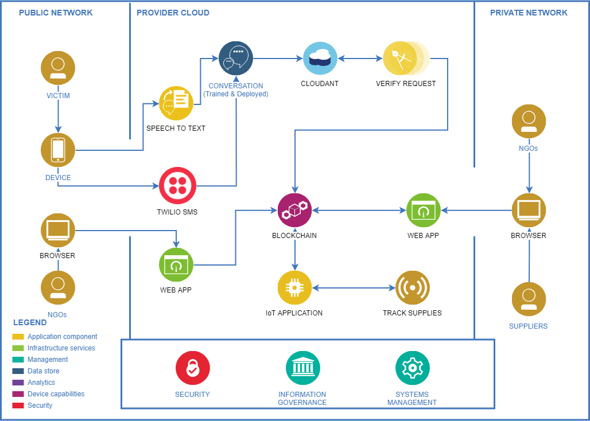

# Blockchain-based survival network & Supplies tracker

### Solution description :

At crisis (Natural Disasters), victims are in state of panic. It takes too much time to report the problem to authorities & more time for NGOs to respond. Some reported disasters earn more hype than others, so supplies are not distributed in an equal manner. While delivering the supplies to victims, supplies can be compromised, stolen orlost.We provide an automated crisis management solution for victims & NGOs. Victims & bystanders can report disasters from any mobile phone (Chatbot or SMS). Our system will verify the requests, assure their authenticity & neglect any false alarm. NGOs can report disasters directly to our system, so another NGOs can aid.Our system will notify NGOs to ship supplies to nearby victims. Our system in collaboration with NGOs & supplier will determine the needed supplies based on the situation. Finally, will track the supplies using IoT sensors to make sure it reaches the right destination in a good condition.

### IBM Cloud™ services used :
* Node-RED Starter kit 
* Watson Assistant 
* Speech to text 
* Tone Analyzer 
* Internet of things 
* Cloudant 
* SDK for Node.js 
*Blockchain 
*Discovery

## Solution diagram:

