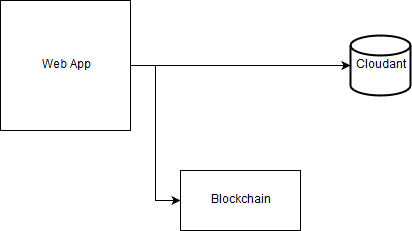

# Web Application Documentation

- ### Introduction
This web application is used by organizations and trusted participants within a network to perform different task within the solution such as: Reporting a Disaster, Sending Supplies, Inquiring about an Incident, ….etc, all within the privileges given to different users based on position in the network. The application also offers a dashboard giving insights about active disasters and supply status, with the ability to perform different queries on the Blockchain network to get full insight about every aspect within the solution. The solution also offers an integration with the Cloudant database in which this document storage is used to feed for the analytics engine for the generation of insights for the web-app dashboard.

- ### Technologies
NodeJS is used as to run the service, as it offers high versatility with the NPM modules offering rapid tool to help development of the application such as: expressJS Framework for HTTP requests, and requestJS offering easy ability to call RESTful APIs. Embeded Java Script is used to make the pages reactive to JSON files coming from the request Responses.

- ### Application Diagram

